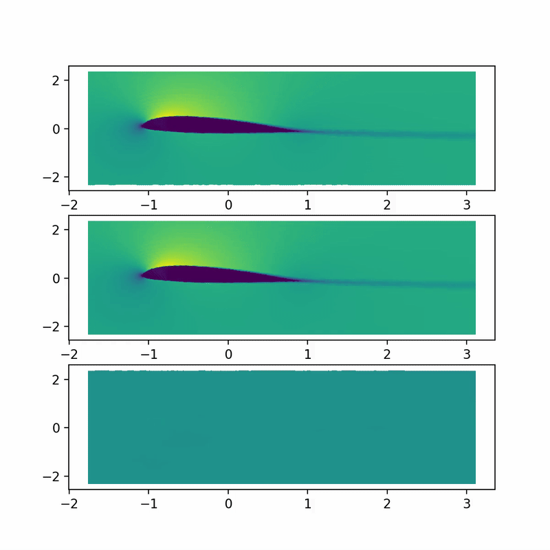
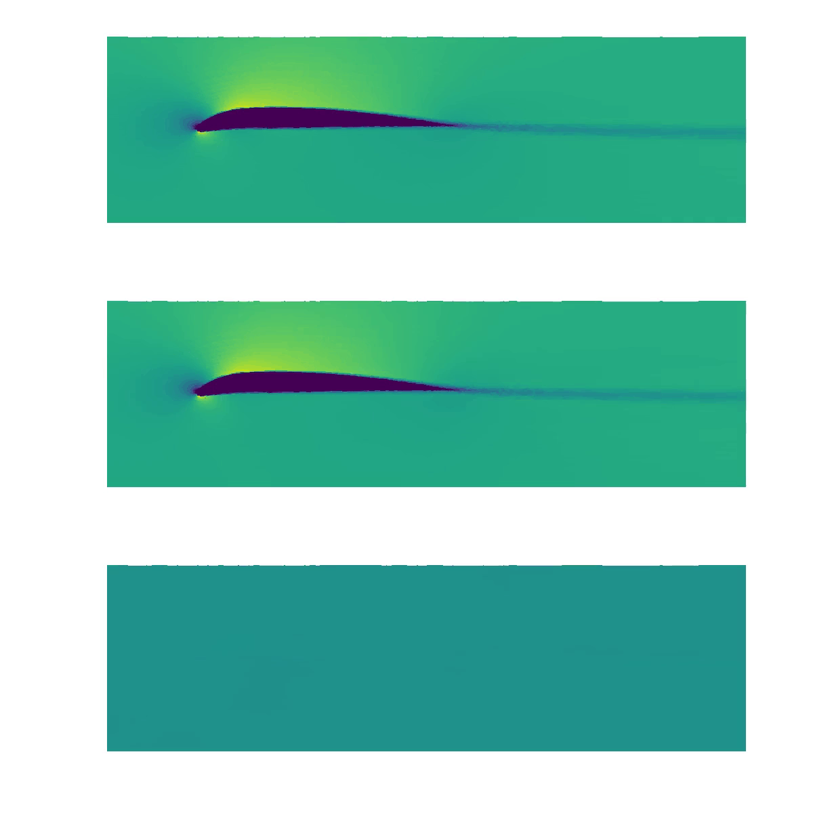
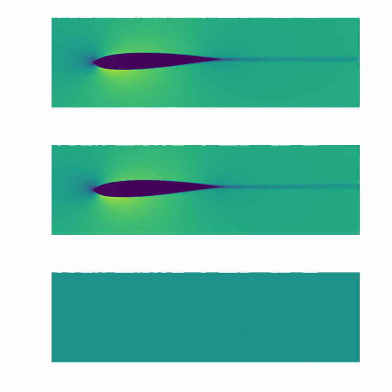

# dynamic_MGN

## Demos
-----------------------
- Here are some examples results of the modified MGN trained on our custom dataset. Top is GT, middle predicted, bottom is the delta between GT and predicted.

<!--  -->

 

